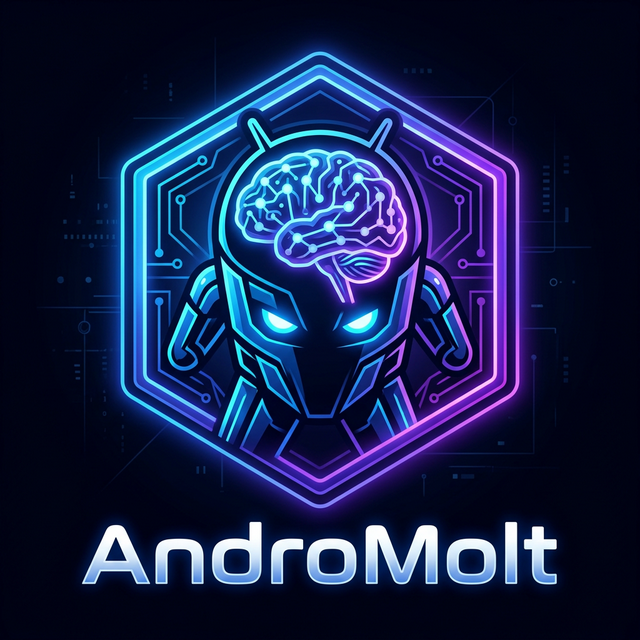

<div align="center">



<br/>

# 🤖 AndroMolt

### **The #1 Android Automation Agentic App** — Powered by AI

<p align="center">
  <a href="https://github.com/JASIM0021/AndroMolt/stargazers">
    
  </a>
  <a href="https://github.com/JASIM0021/AndroMolt/forks">
    
  </a>
  <a href="https://github.com/JASIM0021/AndroMolt/issues">
    
  </a>
  
  
  
  
</p>

<br/>

> **Talk to your phone. It listens. It acts.**
>
> AndroMolt is the world's first fully native Android AI agent that autonomously controls your device using natural language — no scripting, no tapping, no limits.

<br/>

<a href="#-quick-start">
  
</a>
&nbsp;
<a href="#-upcoming-features">
  
</a>
&nbsp;
<a href="#-architecture">
  
</a>

</div>

---

## ✨ What is AndroMolt?

**AndroMolt** redefines how humans interact with Android. Instead of tapping through menus, you just describe what you want — in plain English — and the AI agent does it for you. Autonomously. Intelligently. Instantly.

```
You say:   "Open WhatsApp and send good morning to mom"
           "Play the latest Bollywood playlist on YouTube"
           "Open Settings and turn on Wi-Fi then open Chrome and search the weather"

AndroMolt: ✅ Done.
```

Unlike screen-recording or macro tools, AndroMolt uses **live AI reasoning** at every step — reading the actual UI tree, planning the next action, and adapting when things don't go as expected. It's not a script. It's an **agent**.

---

## 🎯 Key Highlights

<table>
<tr>
<td width="50%">

### 🧠 Native AI Agent Loop
The entire agent — observe, plan, act — runs in **Kotlin on a background thread**. The agent keeps working even when the app is backgrounded.

</td>
<td width="50%">

### 👁️ Real UI Understanding
Reads Android's **Accessibility Tree** in real-time. Understands every button, text field, scroll view — exactly like a human would.

</td>
</tr>
<tr>
<td width="50%">

### ⚡ Multi-LLM Support
Seamlessly switches between **OpenAI GPT-4o-mini** and **Google Gemini 2.0 Flash**. Falls back to rule-based heuristics if no key is provided.

</td>
<td width="50%">

### 🔄 Self-Healing Agent
Detects when it's stuck (same screen 4+ times) and automatically retries by pressing Back and replanning.

</td>
</tr>
<tr>
<td width="50%">

### 💬 Chat-Native UX
Clean, premium chat interface with live step-by-step logs, reasoning traces, and action feedback in real time.

</td>
<td width="50%">

### 🔒 On-Device Privacy
All UI interaction happens **locally on your device**. Only the UI snapshot + goal is sent to the LLM API — never screenshots or personal data.

</td>
</tr>
</table>

---

## 🏗️ Architecture

```
╔═══════════════════════════════════════════════════════════╗
║            React Native / Expo  (UI Layer)                ║
║         components/ChatInterface.tsx                      ║
║   • Natural Language Input  • Live Agent Logs             ║
║   • Progress Indicators     • App Picker                  ║
╚═══════════════════╦═══════════════════════════════════════╝
                    ║  NativeModules.AndroMoltCore
                    ║  .runNativeAgent(goal, apiKeys)
                    ▼
╔═══════════════════════════════════════════════════════════╗
║              Kotlin / Android Native  (Agent Core)        ║
║                                                           ║
║  AndroMoltCoreModule.kt  ←── React Native Bridge          ║
║    └── NativeAgentLoop.kt        (Background Thread)      ║
║          ├── NativeLlmClient.kt                           ║
║          │     ├── OpenAI GPT-4o-mini                     ║
║          │     ├── Google Gemini 2.0 Flash                 ║
║          │     └── FallbackHeuristics.kt                  ║
║          └── AccessibilityController.kt                   ║
║                └── AndroMoltAccessibilityService.kt       ║
╚═══════════════════════════════════════════════════════════╝
```

> **The TypeScript layer is UI-only.** All automation logic — the agent loop, LLM calls, and UI interaction — runs entirely in Kotlin on a native Android background thread.

---

## 🔁 How the Agent Loop Works

Each step inside `NativeAgentLoop.kt` follows a clean **OBSERVE → PLAN → ACT → SETTLE** cycle:

| Phase | What happens |
|:---:|---|
| 👁️ **OBSERVE** | `AccessibilityController.getUiSnapshot()` reads the live screen. `UiTreeBuilder` compresses it to a max-150-element text snapshot the LLM can reason about. |
| 🧠 **PLAN** | `NativeLlmClient.getNextAction()` sends the goal + screen snapshot to the LLM, which responds with a single structured JSON action. |
| ⚡ **ACT** | `AccessibilityController` executes the action — click, type, scroll, launch, swipe — via the Android Accessibility API. |
| ⏳ **SETTLE** | Waits 2000ms for the UI to update, then loops back to OBSERVE. |

**Stuck detection:** if the same screen hash appears 4+ times with 2+ consecutive failures, the agent automatically presses Back and retries with a new plan.

---

## 🤖 LLM Decision Chain

`NativeLlmClient.kt` tries providers in this priority order:

```
Priority 1 ──► OpenAI GPT-4o-mini     (if EXPO_PUBLIC_OPENAI_API_KEY is set)
Priority 2 ──► Google Gemini 2.0 Flash (if EXPO_PUBLIC_GEMINI_API_KEY is set)
Priority 3 ──► FallbackHeuristics      (rule-based, no API required — limited)
```

---

## 🔮 Upcoming Features

> AndroMolt is just getting started. Here's what's coming — and it's going to be **massive**.

<table>
<tr>
<td align="center" width="33%">

### 🖥️ MCP Server
**Model Context Protocol** support — expose your Android device as an MCP resource. Control your phone from any MCP-compatible AI client, IDE, or custom tool.

`status: In Development`

</td>
<td align="center" width="33%">

### 📡 Remote Control
Control your Android device **from anywhere** — PC, browser, or another device. Trigger automations remotely via a secure web dashboard or REST API.

`status: Planned`

</td>
<td align="center" width="33%">

### 🎨 Better UI
A completely redesigned, **ultra-premium interface** — animated agent status, live visual overlays showing what the agent is clicking, and a beautiful command history timeline.

`status: In Development`

</td>
</tr>
<tr>
<td align="center" width="33%">

### 🔌 Multiple LLM Providers
Plug in **any LLM** — Anthropic Claude, Mistral, Cohere, DeepSeek, OpenRouter, and more. Choose your preferred AI brain per task or let AndroMolt auto-select the best one.

`status: Planned`

</td>
<td align="center" width="33%">

### 🏠 Local LLM Support
Run the agent **100% offline** with local models via Ollama, LM Studio, or llama.cpp. Full privacy, zero API costs, works without internet.

`status: Planned`

</td>
<td align="center" width="33%">

### 🌟 Much More...
Scheduled automations, multi-device orchestration, voice command mode, workflow templates, plugin SDK for developers, and a community marketplace.

`status: Coming Soon`

</td>
</tr>
</table>

---

## 🚀 Quick Start

### Prerequisites

- Android device or emulator (**API 26+**)
- Node.js 18+ and npm
- Android Studio with Android SDK

### 1. Clone & Install

```bash
git clone https://github.com/JASIM0021/AndroMolt.git
cd AndroMolt
npm install
```

### 2. Configure API Keys

Create a `.env` file in the project root:

```env
EXPO_PUBLIC_OPENAI_API_KEY=sk-...
EXPO_PUBLIC_GEMINI_API_KEY=AIza...
```

> At least one key is required for full functionality. Without either key, the agent falls back to rule-based heuristics.

### 3. Run

```bash
npx expo run:android
```

### 4. Grant Accessibility Permission

The app needs **Accessibility Service** permission to control other apps:

1. Tap **"Enable Accessibility"** on the onboarding screen
2. Android Settings opens — find **AndroMolt** in the Accessibility list
3. Enable it and return to the app
4. 🎉 Start automating!

---

## 🎬 Demo Videos

> See AndroMolt in action — **zero tapping, zero scripting, just talk.**

<div align="center">

<table>
<tr>
<td align="center" width="50%">

### 📲 Install App from Play Store


https://github.com/user-attachments/assets/2cdb3b5f-5ef9-447d-a95e-023bab8a7048


> *Say: "Install Spotify from the Play Store" — and watch it happen.*

</td>
<td align="center" width="50%">

### 🎵 Play Songs on YouTube


https://github.com/user-attachments/assets/c0a6da85-f3ec-40a5-bf3b-f0552555cf1b


> *Say: "Open YouTube and play a Hindi song" — done in seconds.*

</td>
</tr>
</table>

</div>

---

## 🎬 Example Commands

```
💬 "Open YouTube and play a Hindi song"
💬 "Send good morning to didi on WhatsApp"
💬 "Open Chrome and search for today's weather"
💬 "Open Settings and turn on Wi-Fi"
💬 "Open Instagram and like the first post"
💬 "Set an alarm for 7 AM tomorrow"
💬 "Open Spotify, search for lo-fi music, and play the first result"
💬 "Go to Amazon, search for wireless earbuds under ₹2000"
```

---

## 🛠️ Supported Actions

| Action | Description |
|:---:|---|
| `open_app` | Launch any app by package name |
| `click_by_text` | Click element with matching visible text |
| `click_by_content_desc` | Click element by accessibility description |
| `click_by_index` | Click element by index in the UI tree |
| `input_text` | Type text into the focused field |
| `press_enter` | Press Enter / keyboard Search button |
| `scroll` | Scroll up or down |
| `back` | Press the system Back button |
| `wait` | Wait N milliseconds |
| `complete_task` | Mark goal as achieved ✅ |

---

## 📡 Event Stream

`EventBridge.kt` emits real-time events via `DeviceEventEmitter`. The chat UI listens and renders them as live, step-by-step logs:

| Event | Payload |
|---|---|
| `agentStart` | `{ goal }` |
| `agentStep` | `{ step, package, elementCount }` |
| `agentThink` | `{ message }` |
| `agentAction` | `{ action, params, reasoning }` |
| `actionResult` | `{ success, message }` |
| `agentComplete` | `{ steps, message }` |

---

## 📁 Project Structure

```
AndroMolt/
├── app/
│   └── (tab)/index.tsx              # Entry point → renders ChatInterface
├── components/
│   ├── ChatInterface.tsx             # Main UI: chat, live logs, progress
│   └── OnboardingScreen.tsx          # Accessibility permission setup
├── lib/
│   ├── automation/
│   │   └── AgentEvents.ts            # AgentEvent type (used by chat UI)
│   └── stores/
│       └── automationStore.ts        # Zustand: chat history + state
├── types/
│   ├── agent.ts                      # AgentAction / AgentResult interfaces
│   └── automation.ts                 # Shared automation types
├── constants/
│   └── theme.ts                      # UI colors and fonts
└── android/app/src/main/java/com/anonymous/androMolt/
    ├── agent/
    │   ├── NativeAgentLoop.kt        # 🔁 OBSERVE-PLAN-ACT loop
    │   ├── NativeLlmClient.kt        # 🧠 LLM API calls (OpenAI / Gemini)
    │   └── FallbackHeuristics.kt     # 🛡️ Rule-based fallback
    ├── accessibility/
    │   ├── AndroMoltAccessibilityService.kt  # Android Accessibility Service
    │   ├── AccessibilityController.kt         # click / type / scroll / launch
    │   └── UiTreeBuilder.kt                   # UI tree → LLM-readable text
    ├── service/
    │   └── AndroMoltForegroundService.kt      # Keeps agent alive in background
    ├── utils/
    │   ├── EventBridge.kt            # Emits events to React Native JS
    │   └── PermissionHelper.kt       # Permission checking
    └── modules/
        └── AndroMoltCoreModule.kt    # @ReactMethod bridge exports
```

---

## 🧰 Tech Stack

| Layer | Technology |
|---|---|
| 📱 UI Framework | React Native + Expo 54 |
| 🗺️ Navigation | Expo Router |
| 🗃️ State Management | Zustand |
| 🤖 AI / LLM | OpenAI GPT-4o-mini · Google Gemini 2.0 Flash |
| ⚙️ Native Automation | Kotlin + Android Accessibility Service |
| 🌐 Native HTTP | OkHttp3 |
| 🔨 Build System | Gradle + Expo Prebuild |

---

## ⚠️ Known Limitations

- Android only (Kotlin + Accessibility Service)
- Accessibility Service permission must be granted manually in Settings
- Screen reading is text-based — purely graphical elements with no text or description may require `click_by_index`
- Maximum 20 steps per task (configurable)
- LLM API keys required for best results; heuristics cover basic flows only

---

## 🤝 Contributing

Contributions are what make the open-source community an incredible place to learn, inspire, and create. **Any contributions you make are greatly appreciated.**

1. Fork the repository
2. Create your feature branch (`git checkout -b feature/AmazingFeature`)
3. Commit your changes (`git commit -m 'Add some AmazingFeature'`)
4. Push to the branch (`git push origin feature/AmazingFeature`)
5. Open a Pull Request

---

## 📜 License

Distributed under the **MIT License**. See [`LICENSE`](LICENSE) for more information.

---

<div align="center">

**Built with ❤️ for the open-source community**

*If AndroMolt saved you time or blew your mind, give it a ⭐ — it means the world to us.*

<br/>


&nbsp;


</div>
